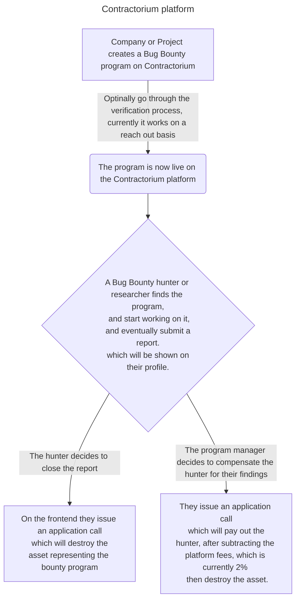

# Contractorium - The Asset Based Bug Bounty platform
## What is Contractorium?
Contractorium is a DApp where companies can create a bug bounty program for their product(s) (Which will be stored in a Box storage, mapped to the program managers address). Which in fact lets Ethical Hackers and researchers around the world, browse a wide variety of public bug bounty programs. If they believe, they found a bug, a low-severity vulnerability, they can submit a report, detailing their findings, and if the company decides so, they can get a compensation for their work. Bounties are represented as ASA's, which makes the whole flow much easier to handle, and more transparent.

### What does the project include?
 - A smart contract written in PyTeal with the help of the Beaker framework.
 - A Frontend for the contract written in SvelteKit, and TailwindCSS, with the help of Beaker-TS, and the generated client.

### But how does it actually work?

## How to setup Contractorium?
First of all, a live instance is deploy on the Testnet, and a frontend app on Vercel which you can find here.. LINK

But, if you decide to set it up here are the steps:
### Contract
Requirements:
 - `poetry`
 - `python 3.10<=`

Steps:
- `cd backend`
- `poetry install`
- inside the poetry environment execute the deploy script inside the utils folder, after specifying your algod config (`poetry shell` and then `python deploy.py`)
- That's it. I swear.

### Frontend
- `cd frontend`
- `npm install`
- Specify the following env vars:
 - `PUBLIC_ALGOD_SERVER`
 - `PUBLIC_ALGOD_PORT`
 - `PUBLIC_APP_ID`
 - `PUBLIC_ALGOD_TOKEN` (It's public as of now, due to the fact that the public Algonode API does not require a token)
 - `PUBLIC_APP_ADDRESS`
 - `PRIVATE_PINATA_JWT`
- `npm run dev`

That'll run a dev server, locally, you'll also need to have a MyAlgo wallet setup.
## ⚠️ Warning! Due to some known issues, you might have to allow the site to open Pop-Ups, it is more than inconvenient, but it's a one time settings adjusting!
